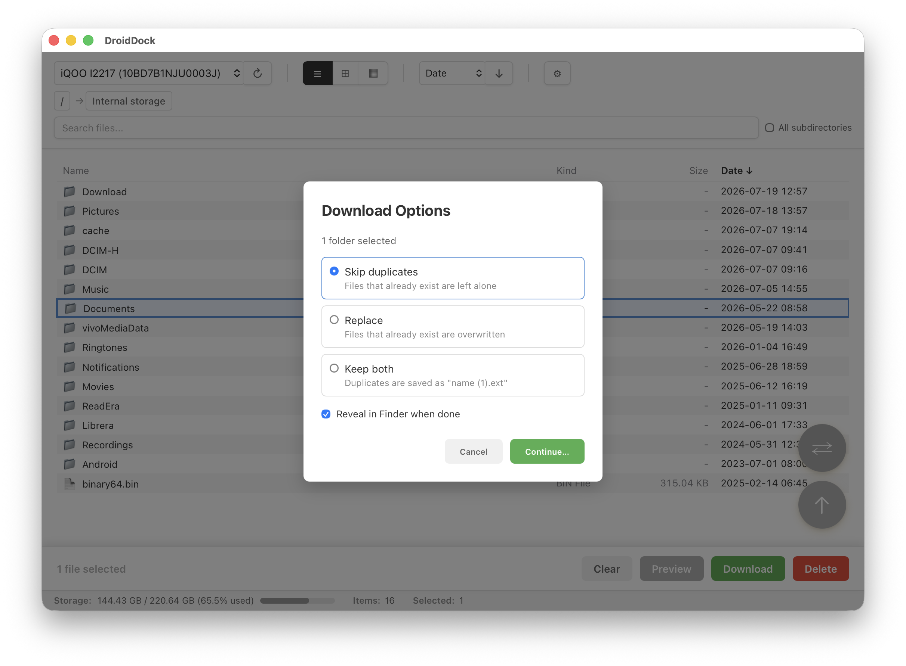
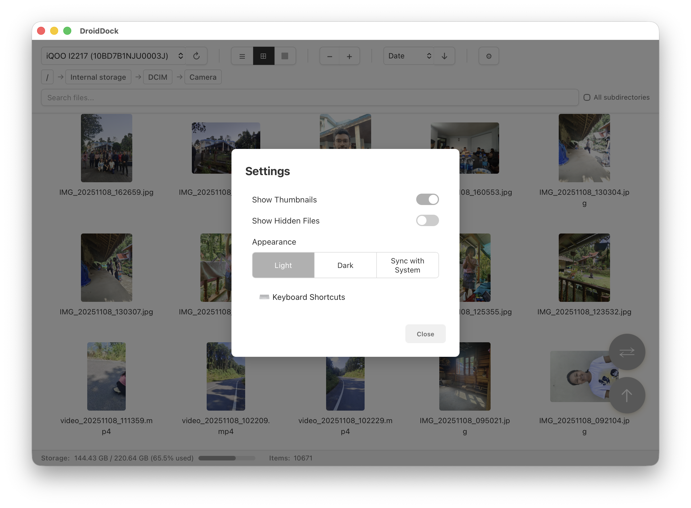
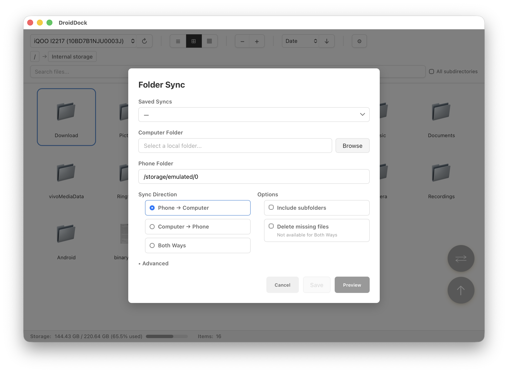
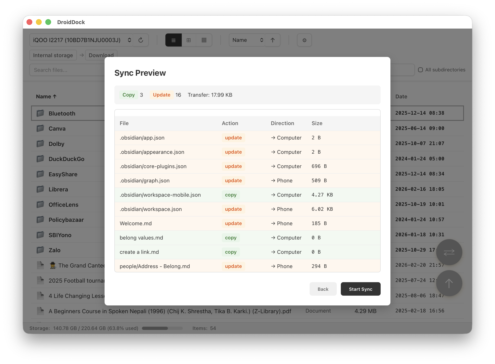
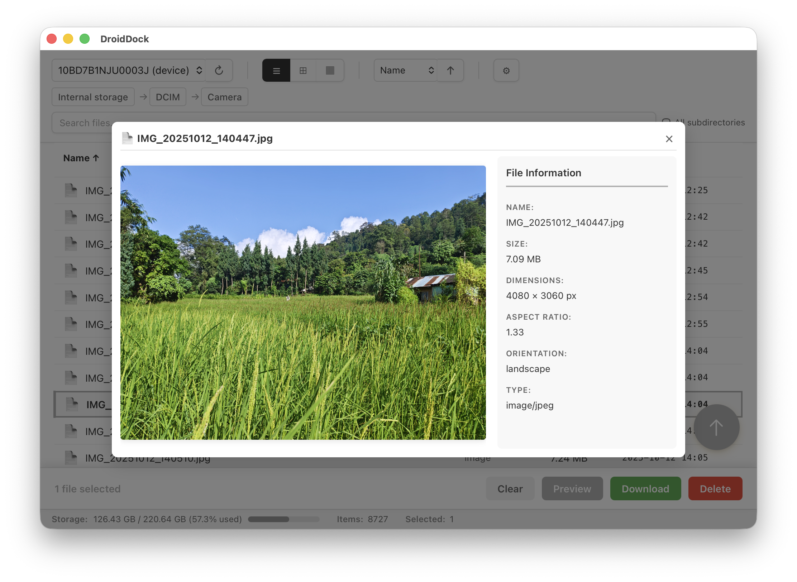
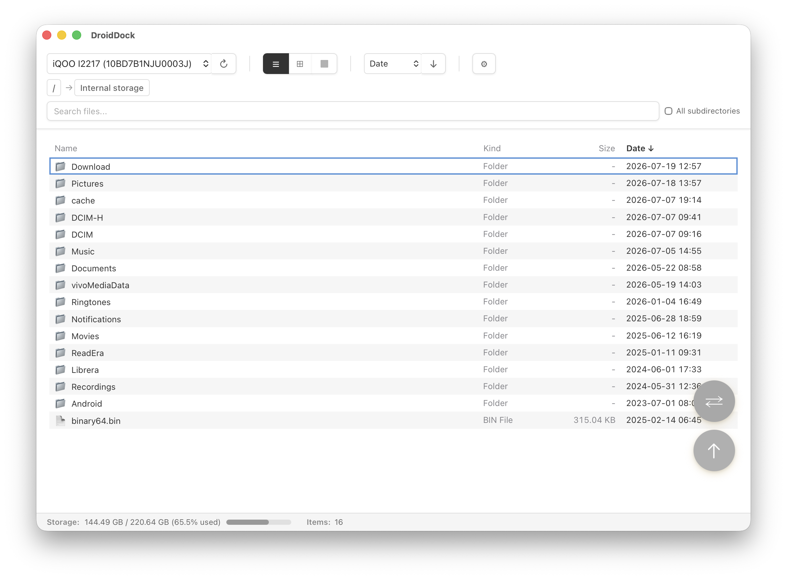
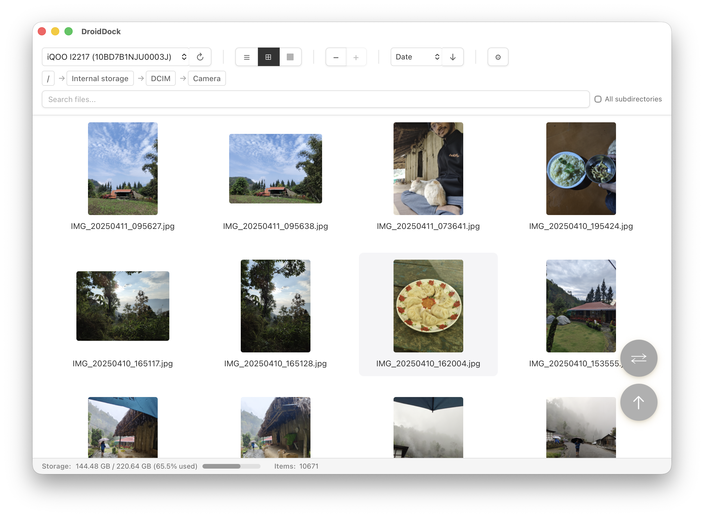
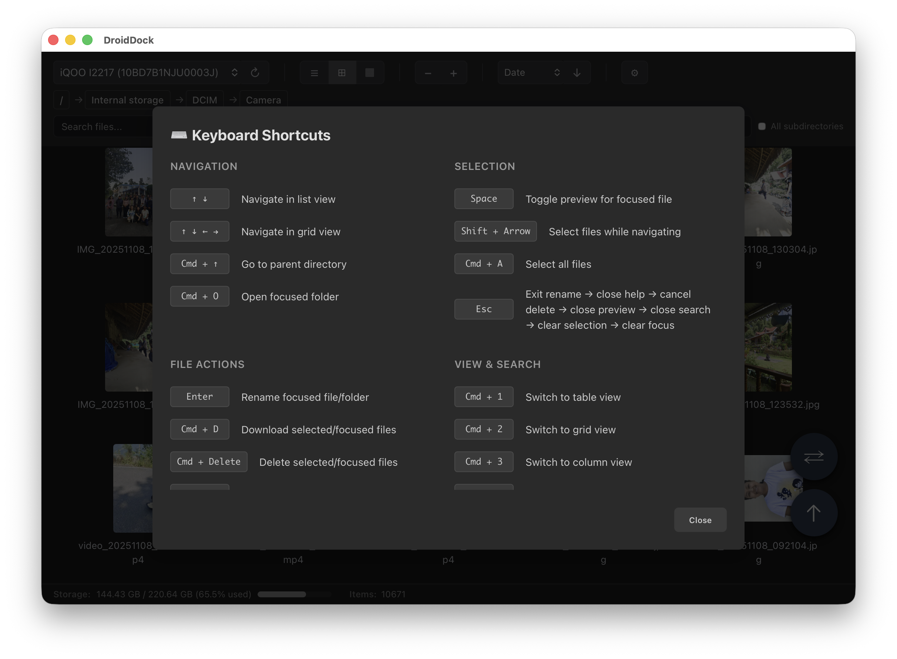

# DroidDock

Browse, download, and manage your Android phone's files from your Mac — no cables-and-folders dance, no cloud upload required.

🌐 **[Visit DroidDock Website](https://rajivm1991.github.io/DroidDock/)**

[](https://github.com/rajivm1991/DroidDock/releases/latest)
[](https://github.com/rajivm1991/DroidDock/releases)
[](https://github.com/rajivm1991/DroidDock/actions)
[](LICENSE)
[](https://github.com/rajivm1991/DroidDock/releases/latest)
[](https://github.com/rajivm1991/DroidDock)
[](https://www.buymeacoffee.com/rajivm1991)

**You don't need to know anything about Android development to use this.** [Download DroidDock](#step-1-install-droiddock), then follow the 5-minute [First Time Setup](#first-time-setup-5-minutes) below.

## First Time Setup (5 minutes)

You only need to do this once. After that, just plug in your phone and open the app.

### Step 1: Install DroidDock

**Option A — Homebrew** (if you're comfortable with Terminal):

```bash
brew tap rajivm1991/droiddock
brew install --cask droiddock
```

**Option B — Direct download** (easiest if you're not):

1. Download the latest `.dmg` from the [Releases page](https://github.com/rajivm1991/DroidDock/releases/latest)
2. Open the DMG and drag **DroidDock** into your **Applications** folder
3. Open DroidDock from Applications. If macOS says it's "damaged and can't be opened", see [Gatekeeper warning](#macos-says-droiddock-is-damaged) below — this is normal for apps not distributed through the App Store, and DroidDock is safe.

### Step 2: Install ADB

DroidDock talks to your phone through **ADB (Android Debug Bridge)** — Google's own official tool for connecting a computer to an Android device. DroidDock is a friendly interface on top of it; it doesn't replace or bypass anything.

```bash
brew install android-platform-tools
```

Don't have Homebrew? Install it first from [brew.sh](https://brew.sh), or grab ADB manually from [Android Platform Tools](https://developer.android.com/tools/releases/platform-tools) — see [Prerequisites](#prerequisites) for manual setup.

### Step 3: Enable USB Debugging on your phone

This is an Android setting that's hidden by default. It tells your phone to trust and allow computer connections.

1. Open **Settings** → **About phone**
2. Find **Build number** and tap it **7 times** — you'll see "You are now a developer!"
3. Go back to **Settings** → **System** → **Developer options** (location varies slightly by phone brand)
4. Enable **USB debugging**

Worried this is risky? See [Is USB Debugging safe?](#is-usb-debugging-safe) below.

### Step 4: Connect your phone

1. Plug your phone into your Mac with a USB cable
2. On your phone, a prompt appears: **"Allow USB debugging?"** — tap **Allow** (check "Always allow from this computer" to skip this next time)
3. Open DroidDock — your phone should appear in the device dropdown within a few seconds

**Done!** Select your device and start browsing.

## New to Android development terms?

### Is USB Debugging safe?

Yes. USB debugging is Android's official developer interface — the same one Android Studio and every Android tool uses. Enabling it does **not** root your phone, void your warranty, or expose your phone to the internet. It only allows a computer you've physically connected and explicitly approved (via the "Allow USB debugging?" prompt) to communicate with your device. You can turn it off anytime afterward in **Developer options**.

### What is ADB?

ADB (Android Debug Bridge) is a command-line tool made by Google that lets a computer talk to an Android device — list files, install apps, view logs, etc. DroidDock uses it under the hood so you get a normal file-browser window instead of typing commands.

### Do I need to redo this setup every time?

No. Once ADB is installed and you've checked "Always allow" on the debugging prompt, just plug in your phone and open DroidDock — no setup required.

### Does DroidDock collect my data?

No. DroidDock does not collect or transmit any personal data. All communication stays between your Mac and your phone over the USB cable.

## Features

- **📱 Device Detection**: Automatically detects connected Android devices and shows their model name
- **📂 File Browsing**: Navigate through your Android device's file system with an intuitive interface
- **👁️ Multiple View Modes**: Choose between Table, Grid, or Column (Miller) view with keyboard shortcuts
- **🖼️ File Preview**: View images and text files without downloading - press Space for quick preview or double-click
- **🔁 Folder Sync**: Sync entire folders between Mac and Android — filter by file pattern, exclude system files, preserve timestamps
- **🔍 File Search**: Search for files by name with case-insensitive matching and recursive search
- **🗑️ File Deletion**: Delete files and folders with confirmation dialogs and safety checks
- **📥 File Download**: Download files and entire folders from device to Mac, with per-download conflict handling
- **📤 File Upload**: Upload files from Mac to device via floating action button
- **✅ Multi-Select**: Select multiple files with click, Ctrl/Cmd+click, and Shift+click range selection
- **🖼️ Thumbnails**: Automatic thumbnail generation for images and videos with lazy loading
- **🏠 Smart Breadcrumbs**: Clean navigation with "Internal storage" labels and arrow separators
- **👁️ Hidden Files Toggle**: Show or hide dot files with a single click
- **📊 File Information**: View file types, permissions, sizes, and modification dates
- **💾 Storage Info**: Real-time storage usage display in VSCode-style status bar
- **🎯 Contextual Actions**: File actions (download/delete) appear in a slide-up bar when files are selected
- **⌨️ Keyboard Shortcuts**: Full keyboard navigation with arrow keys, view switching, and file operations
- **🎨 Appearance**: Light, Dark, or Sync with System — settings modal opens with the gear icon or Cmd+,
- **🛠️ Smart ADB Detection**: Automatically finds ADB in common installation locations
- **⚙️ Custom ADB Path**: Set a custom ADB path if it's not automatically detected

## Screenshots



_Recursive folder download with per-download conflict handling_



_Settings modal with Light/Dark/Sync with System appearance control_



_Folder sync between Mac and Android with filtering options_



_Preview what will change before running the sync_



_Preview images directly in DroidDock with metadata panel and keyboard navigation_



_Browse files in a clean, space-efficient list format_



_Visual browsing with image thumbnails_



_Full keyboard navigation with a helpful reference_

## Using DroidDock

Once setup is complete:

- **Single-click** a file or folder to select it
- **Double-click** a folder to open it, or a file to preview it (images, text files)
- **Press Space** to quick-preview the focused file without changing selection
- Use **breadcrumb navigation** or the **↑ Up** button to go back
- **Switch Views**: Use view toggle buttons or keyboard shortcuts (Cmd+1/2/3) to switch between Table, Grid, or Column view
- Open **Settings** (gear icon or Cmd+,) to toggle hidden files, thumbnails, and appearance
- Click **Refresh** to reload the device list
- **Upload Files**: Click the floating action button (bottom-right) to upload files to current directory
- **File Actions**: Select files or folders to reveal the contextual action bar with Download and Delete options

### Search for Files

- Type in the **search bar** to find files by name (case-insensitive)
- Check **All subdirectories** to search recursively through all folders
- Click **Search** or press Enter to execute the search
- Search results show full file paths
- Click **Clear** to exit search mode

### Select & Delete Files

- **Click row** to select files (no more checkboxes!)
- **Ctrl/Cmd + Click**: Toggle individual files for multi-select
- **Shift + Click**: Select a range of files between two clicks
- **Ctrl/Cmd + A**: Select all visible files
- Press **Delete** or **Backspace** key to delete selected files
- Confirm deletion in the dialog that appears
- The app prevents deletion of critical system directories

## Keyboard Shortcuts

DroidDock supports these keyboard shortcuts for faster navigation and file management:

| Shortcut                | Action                                                            |
| ----------------------- | ----------------------------------------------------------------- |
| `Ctrl/Cmd + F`          | Focus search bar                                                  |
| `Ctrl/Cmd + A`          | Select all visible files                                          |
| `Ctrl/Cmd + 1`          | Switch to Table view                                              |
| `Ctrl/Cmd + 2`          | Switch to Grid view                                               |
| `Ctrl/Cmd + 3`          | Switch to Column view                                             |
| `Ctrl/Cmd + =/-`        | Zoom in/out (Grid view only)                                      |
| `Cmd + ,`               | Open settings                                                     |
| `Cmd + I`               | Open folder sync dialog                                           |
| `Cmd + U`               | Open upload file picker                                           |
| `Arrow Keys`            | Navigate between files (Up/Down in table, all directions in grid) |
| `Space`                 | Quick-preview focused file (or close preview)                     |
| `Enter`                 | Open focused folder or execute search                             |
| `Delete` or `Backspace` | Delete selected files (shows confirmation dialog)                 |
| `Escape`                | Clear selection or close dialogs                                  |
| **In Preview Mode**     |                                                                   |
| `Arrow Keys`            | Navigate to next/previous file                                    |
| `Escape` or `Space`     | Close preview                                                     |

## Troubleshooting

### macOS says DroidDock is "damaged"

When downloading from GitHub (rather than the Mac App Store), macOS's Gatekeeper flags unsigned apps with this warning even though the app is safe. Run this once in Terminal:

```bash
xattr -cr /Applications/DroidDock.app
```

Then launch the app normally. Future releases will be code-signed to eliminate this step.

### ADB Not Found

If the app can't find ADB:

1. **Install ADB** via Homebrew:

   ```bash
   brew install android-platform-tools
   ```

2. **Or set a custom path**:
   - The app will show a setup screen
   - Enter the full path to your ADB executable (e.g., `/opt/homebrew/bin/adb`)
   - Click "Set Path"

### Device Not Showing Up

- Ensure USB debugging is enabled on your device (see [Step 3](#step-3-enable-usb-debugging-on-your-phone))
- Check if device is recognized: `adb devices`
- Try clicking the "Refresh" button in the app
- You may need to accept the debugging authorization prompt on your device

### "Not Supported on This Mac" Error

DroidDock requires **macOS 10.15 (Catalina) or later** and supports both Intel and Apple Silicon Macs. If you see this error:

1. **Verify your macOS version**: Go to Apple menu > About This Mac
2. **Try the Gatekeeper workaround**: Right-click the app and choose "Open" instead of double-clicking
3. **Clear quarantine attributes**:
   ```bash
   xattr -cr /Applications/DroidDock.app
   ```
4. If the issue persists, please [open an issue](https://github.com/rajivm1991/DroidDock/issues) with your Mac model and macOS version

### Permission Errors When Browsing

- Some system directories require root access
- Try browsing user-accessible directories like `/storage/emulated/0` or `/sdcard`

### Can't Navigate Into Folders

- **Double-click** the folder row to open it
- Wait for the loading indicator to finish
- Note: A single click only selects the folder — it won't open it

## Support

If you encounter any issues or have questions:

- Open an issue on [GitHub Issues](https://github.com/rajivm1991/DroidDock/issues)
- Check the [Troubleshooting](#troubleshooting) section above

### Buy Me a Coffee

DroidDock is free and open-source, made by one developer in their spare time. If it saves you time, buy me a coffee — it means a lot!

☕ **[buymeacoffee.com/rajivm1991](https://www.buymeacoffee.com/rajivm1991)**

---

## Developer Guide

Everything below is for people building, contributing to, or releasing DroidDock — not needed to just use the app.

### Prerequisites

**ADB (Android Debug Bridge)**:

```bash
brew install android-platform-tools
```

Or download manually from [Android Platform Tools](https://developer.android.com/tools/releases/platform-tools).

DroidDock automatically checks these common ADB locations:

- `/opt/homebrew/bin/adb` (Apple Silicon Homebrew)
- `/usr/local/bin/adb` (Intel Mac Homebrew)
- `/opt/local/bin/adb` (MacPorts)
- `~/Library/Android/sdk/platform-tools/adb` (Android Studio)

**Node.js**: Version 20.19+ or 22.12+ — [nodejs.org](https://nodejs.org/)

**Rust**: [rustup.rs](https://rustup.rs/)

### Build from Source

1. Clone the repository:

   ```bash
   git clone https://github.com/rajivm1991/DroidDock.git
   cd droiddock
   ```

2. Install dependencies:

   ```bash
   npm install
   ```

3. Run in development mode:

   ```bash
   npm run tauri dev
   ```

4. Or build for production:

   ```bash
   npm run tauri build
   ```

   The compiled app will be in `src-tauri/target/release/bundle/`.

### Tech Stack

- **Frontend**: React + TypeScript + Vite
- **Backend**: Rust + Tauri
- **Styling**: Custom CSS with dark mode support

### Project Structure

```
droiddock/
├── src/                 # React frontend
│   ├── App.tsx         # Main application component
│   ├── App.css         # Styles
│   └── main.tsx        # Entry point
├── src-tauri/          # Rust backend
│   ├── src/
│   │   ├── lib.rs      # ADB commands and core logic
│   │   └── main.rs     # Application entry point
│   ├── Cargo.toml      # Rust dependencies
│   └── tauri.conf.json # Tauri configuration
└── package.json        # Node.js dependencies
```

### Available ADB Commands

The app implements these Tauri commands:

- `check_adb()` - Verify ADB installation
- `get_devices()` - List all connected devices
- `list_files(device_id, path)` - List files in a directory
- `delete_file(device_id, file_path, is_directory)` - Delete files and folders with safety checks
- `search_files(device_id, search_path, pattern, recursive)` - Search for files by name
- `get_thumbnail(device_id, file_path, extension, file_size)` - Generate thumbnails for images and videos
- `detect_storage_path(device_id)` - Automatically detect the primary storage path
- `get_storage_info(device_id, path)` - Get storage usage statistics for device
- `download_file(device_id, device_path, local_path)` - Download file from device to Mac
- `upload_file(device_id, local_path, device_path)` - Upload file from Mac to device
- `set_adb_path(path)` - Set custom ADB path
- `get_current_adb_path()` - Get current ADB path

### Run Development Server

```bash
npm run tauri dev
```

Changes to React files will hot-reload automatically. Changes to Rust files will trigger recompilation.

### Run Tests

```bash
# Frontend tests
npm test

# Rust tests
cd src-tauri && cargo test
```

### Preview GitHub Pages Locally

To preview the website (`docs/index.html`) locally:

```bash
# Using Python (built-in on macOS)
cd docs && python3 -m http.server 8080

# Or using npx
cd docs && npx serve
```

Then open http://localhost:8080 in your browser.

To stop the server: Press `Ctrl+C` or run `pkill -f "python3 -m http.server 8080"`

### Releases & Distribution

DroidDock uses an automated release workflow:

1. **Prepare the release** (updates versions and creates git tag):

   ```bash
   npm run release:prepare 0.2.0
   ```

2. **Push the changes and tag**:

   ```bash
   git push origin <branch-name>
   git push origin v0.2.0
   ```

3. **Automated build**: GitHub Actions will:
   - Build a universal macOS binary (Apple Silicon + Intel)
   - Create a DMG installer
   - Generate updater manifest with signature
   - Create a GitHub Release with the DMG attached

4. **Auto-update**: Users with existing installations will be notified of the update.

**Workflow details**:

- **Workflow file**: `.github/workflows/release.yml`
- **Version script**: `scripts/release-prepare.js`
- **Updater config**: `src-tauri/tauri.conf.json` (plugins.updater)
- **Signing**: Uses Tauri updater signatures (stored in GitHub Secrets)

**Code Signing (Future)**: To remove macOS security warnings, code signing requires an Apple Developer Program membership ($99/year), a code signing certificate, and a notarization workflow.

### Future Enhancements

Potential features for future releases:

- 💾 **Drag & Drop** - Drag files to/from the app
- 📱 **Multiple Devices** - View multiple devices simultaneously
- 📊 **Sortable Columns** - Sort files by name, size, date, etc.
- 🎬 **Video Preview** - Preview video files in-app
- 🔄 **Two-Way Sync** - Bidirectional sync with conflict resolution

### Contributing

Contributions are welcome! Please feel free to submit a Pull Request.

1. Fork the repository
2. Create your feature branch (`git checkout -b feature/AmazingFeature`)
3. Commit your changes (`git commit -m 'Add some AmazingFeature'`)
4. Push to the branch (`git push origin feature/AmazingFeature`)
5. Open a Pull Request

### License

MIT License - see [LICENSE](LICENSE) file for details.

### Acknowledgments

- Built with [Tauri](https://tauri.app/) - A framework for building desktop applications with web technologies
- Icons from system emoji set
- Inspired by the need for a simple, native Android file browser on macOS

---

**Note**: DroidDock requires USB debugging to be enabled on your Android device. This app does not collect or transmit any personal data.
